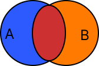

# Algorithm Theory, Datasructures

---

## Table of Content
[Elementary Algorithms](#elementary-algorithms)

---

## Elementary
| | |
| ----------- | ----------- |
| Sum      | Összegzés(Sorozatszámítás) |
| Decision | Eldöntés tétele |
| Selection| Kiválasztás |
| Count| Megszámlálás |
| Max / Min| Maximum / Minimumkiválasztás |

## Set
| | |
| ----------- | ----------- |
| Union | Unióképzés |
| Intersection | Metszetképzés |
| | |

## Search
| | |
| ----------- | ----------- |
| Linear Search | Lineáris keresés |
| Binary / Logarithmic Search | Bináris / Logaritmikus keresés |
| | |

## Sorting
| Simple Sorts | |
| ----------- | ----------- |
| X | Rendezés közvetlen kiválasztással |
| X | Rendezés minimum kiválasztással |
| Insertion Sort | Egyszerű beillesztéses rendezés |
| | |

| Efficient sorts | |
| ----------- | ----------- |
| Sheelsort | Shell-módszer beszúrással |
| Quicksort | Gyorsrendezés |
| | |

| Bubble Sort + Variants | |
| ----------- | ----------- |
| Bubble Sort | Buborék rendezés |
| Comb Sort | Összefésülő rendezés |
| | |

---

### Sum ( ∑ )
How many elements are there with property T in the array?

### Decision
Is there an element of T property in the array?
We are unaware if there is an element like that.

### Selection
We are aware that there is an element with T property in the array.
What is the very first element's index?

### Count
We return the amount of elements inside the array with property T.

### Copy
We put all elements with property T into a separate array.

### Max / Min value
Return the element with the greatest, lowest value or their index in the array.

---

### Union ( A∪B )
**!!! We assume that none of the input contains duplicates of the same element !!!**

  
**IN**:	A, B arrays  

**ALGO**  
1. Copy all elements from A into C
2. Select elements from B and put them into C if they are not yet present in C

**OUT**: C array

### Intersection ( A∩B )
**!!! We assume that none of the input contains duplicates of the same element !!!**

  

**IN**:	A, B arrays  

**ALGO**  
1. Check all elements of A with all elements of B and if both have the same element put it into C.

**OUT**: C array

---

### Linear Search
Is there an element of T property in the array?
If there is, what place does it occupies in the array?

### Binary / Logaritmic Search
Input has to be in sorted order.
Is there an element in the array?
What is the very first element's index?
We always try to find a new middle inside the array, that way we can completely ignore one of the sides we are sure the answer isn't in. 

---
### Generally
Quicksort is the most common, effective sorting algorithm.

The worst time complexity for it begged me to wonder if there is another alternative.

Merge/Heap sort turned out to be more stable than quicksort.

However quicksort's issue about specific input scenaries can be fought with:  
Introsort, which is what `std::sort` uses in C++ too.

Introsort is a mix of quicksort's efficiency, heap sort's stableness and median of medians.
There is also Timsort, which I haven't researched yet, but its generally used in most programming languages.

For the future:  
Definitely learn all the sorting algorithms, since each algo can be used the most efficiently based on the input.
For example: bubble sort could be even more efficient than quicksort in a partly sorted out array of

TODO:  
Research the environments which are most fruitful for the most efficient sort algos.

Source(s):  
https://youtu.be/_dlzWEJoU7I  
https://en.wikipedia.org/wiki/Introsort
https://www.bigocheatsheet.com/
https://youtu.be/UqmKiz2P0Lw
https://youtu.be/kgBjXUE_Nwc
non comperative sorting
https://www.codercorner.com/RadixSortRevisited.htm
https://developer.nvidia.com/gpugems/gpugems3/part-vi-gpu-computing/chapter-39-parallel-prefix-sum-scan-cuda

https://teachyourselfcs.com/
Books:
https://www.amazon.com/Designing-Data-Intensive-Applications-Reliable-Maintainable/dp/1449373321#customerReviews
https://www.amazon.com/Computer-Systems-Programmers-Perspective-3rd/dp/013409266X#customerReviews

### Selection Sort

### Another Sort
To eliminate needless sorting steps, we introduce two cache variables.

### Insertion Sort

### Shellsort

### Quicksort

### Bubble Sort

### Comb Sort